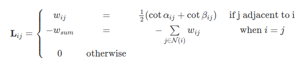
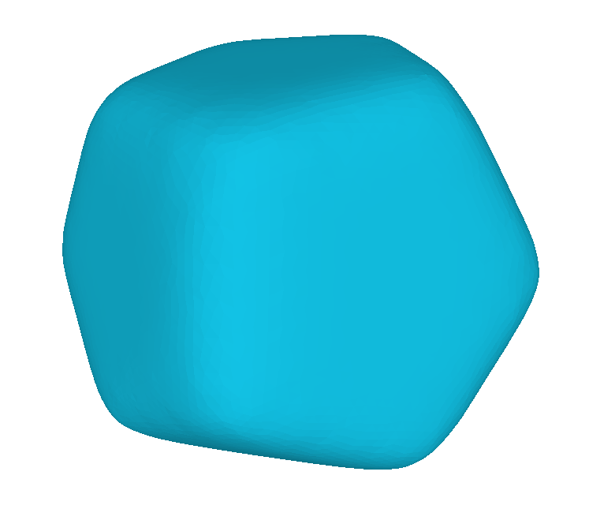
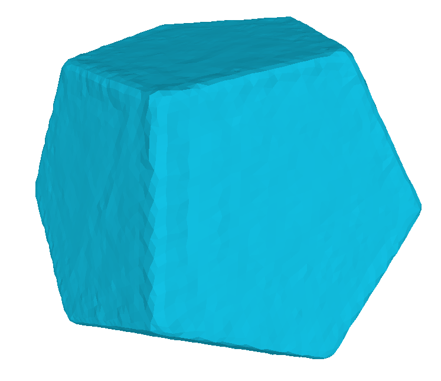
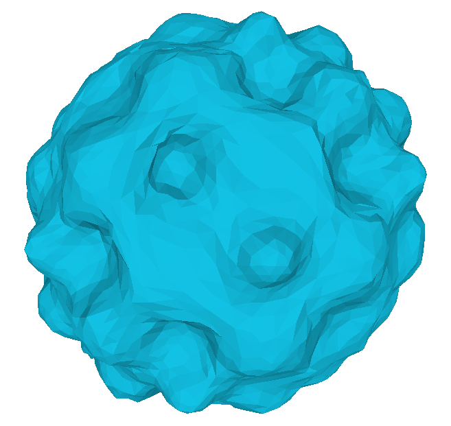
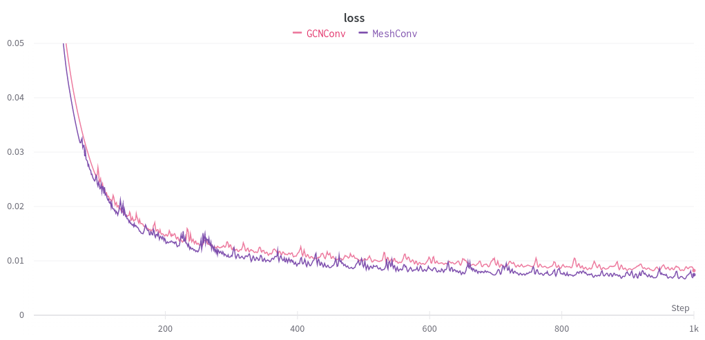

[[English]](README.md) [[日本語]](README_ja.md)

This page is under construction...
# Mesh Convolutional Network

The implementation of **Geometric-aware Mesh Convolutional Network** based on [Semi-Supervised Classification with Graph Convolutional Networks](http://arxiv.org/abs/1609.02907) [ICLR 2017].

## Environment
```
torch
torch_geometric
scipy
```

# Review of GCNConv [ICLR2017] 
## Graph Convolutional Layer

$$
\begin{align}
f(A,X;W) \rightarrow& \sigma((I_N + D^{-\frac{1}{2}} A D^{-\frac{1}{2}}) X W)\\
=& \sigma((2I_N - \hat{L}) X W)\\
=& \sigma(\hat{D}^{-\frac{1}{2}} \hat{A} \hat{D}^{-\frac{1}{2}} X W)
\end{align}
$$

### Variable
- $A \in \{0, 1\}^{n\times n} $: Adjacency matrix
- $D \in \mathbb{R}^{n \times n}$: Degree matrix
- $L \in \mathbb{R}^{n \times n}$: Graph Laplacian matrix 
- $\hat{L} = D^{-\frac{1}{2}} L D^{-\frac{1}{2}} = I_N - D^{-\frac{1}{2}} A D^{-\frac{1}{2}}$: Symmetrically normalized graph Laplacian
- $X \in \mathbb{R}^{n \times d}$: Vertex feature matrix (Input to each layer)
- $W \in \mathbb{R}^{d \times d^{\prime}}$: Learnable weight matrix
- $\sigma$: Activation function (ex. ReLU, softmax)

### Intuitive understanding

coming soon...

# Extention to Mesh Convolution

Replace **graph laplacian** $G$, which only encodes connectivity of mesh, to **mesh laplacian** $M$, which also encodes geometry of mesh.

## Variable
- $M \in \mathbb{R}^{n \times n}$: Mesh Laplacian matrix
- $\hat{M} = D^{-\frac{1}{2}} M D^{-\frac{1}{2}}$: Symmetrically normalized mesh Laplacian

## [Mesh Laplacian](http://rodolphe-vaillant.fr/entry/101/definition-laplacian-matrix-for-triangle-meshes)

- Mesh Laplacian is defined as $L$ in the figure below．



$$
\begin{align}
f(A,X;W) \rightarrow& \sigma((2I_N - \hat{M}) X W)
\end{align}
$$

# Experiment: Mesh Restoration

## Settings

Assign a 6-dimensional feature to each vertex and train MeshConv to restore an original mesh from an smoothed mesh.
Compare the performance between GCNConv and MeshConv.

- Learning rate: 0.001
- Epoch: 1000
- Metrix: MSELoss of vertex position

## Results

- MeshConv outperform GCNConv.
- MeshConv can restore bumpy-sphere (bottom) more accurately than GCNConv.

<table>
  <tr>
    <td width="24%">Input</td>
    <td width="24%">GCNConv</td>
    <td width="24%">MeshConv</td>
    <td width="24%">Ground truth</td>
  </tr>
  <tr>
    <td width="24%"></td>
    <td width="24%"></td>
    <td width="24%"></td>
    <td width="24%"></td>
  </tr>

  <tr>
    <td width="24%">---</td>
    <td width="24%">0.008221</td>
    <td width="24%">0.007452</td>
    <td width="24%">---</td>
  </tr>
  <tr>
    <td width="24%"></td>
    <td width="24%"></td>
    <td width="24%"></td>
    <td width="24%"></td>
  </tr>

  <tr>
    <td width="24%">---</td>
    <td width="24%">0.09511</td>
    <td width="24%">0.05705</td>
    <td width="24%">---</td>
  </tr>
</table>


## Loss transition

### Dodecahedron


### Bumpy-sphere
