[[English]](README.md) [[日本語]](README_ja.md)
# メッシュ畳み込みネットワーク (Mesh Convolutional Network)

様々なGraph Neural Network(GNN)が揃ったライブラリとしてpytorch-geometricがあるが，メッシュデータのような幾何形状を考慮したGNNは実装されていない．そこで，本リポジトリではメッシュ用のGCN，メッシュ畳み込みネットワーク (Mesh Convolutional Network)を実装する．

本GCNは，[Semi-Supervised Classification with Graph Convolutional Networks](http://arxiv.org/abs/1609.02907) [ICLR 2017]に基づいた実装となっている．

## 動作環境
```
torch 1.7.0
torch-geometric 1.7.1 
scipy 1.6.2
numpy 1.19.2
```

## 使用例
```
from util.layer import MeshConv

class MeshNet(nn.Module):
    def __init__(self, mesh):
        super(MeshNet, self).__init__()
        self.model = nn.Sequential(
            MeshConv(6, 32, mesh),
            nn.BatchNorm1d(32),
            nn.LeakyReLU(),
            MeshConv(32, 128, mesh),
            nn.BatchNorm1d(128),
            nn.LeakyReLU(),
            MeshConv(128, 128, mesh),
            nn.BatchNorm1d(128),
            nn.LeakyReLU(),
            MeshConv(128, 32, mesh),
            nn.BatchNorm1d(32),
            nn.LeakyReLU(),
            MeshConv(32, 16, mesh),
            nn.BatchNorm1d(16),
            nn.LeakyReLU(),
            nn.Linear(16, 3),
        )

    def forward(self, x):
        out = self.model(x)
        return out
```

# GCNConv [ICLR2017] のまとめ
## グラフ畳み込み層

$$
\begin{align}
f(A,X;W) \rightarrow& \sigma((I_N + D^{-\frac{1}{2}} A D^{-\frac{1}{2}}) X W)\\
=& \sigma((2I_N - \hat{L}) X W)\\
=& \sigma(\hat{D}^{-\frac{1}{2}} \hat{A} \hat{D}^{-\frac{1}{2}} X W)
\end{align}
$$

### 変数の説明
- $A \in \{0, 1\}^{n\times n} $: 隣接行列
- $D \in \mathbb{R}^{n \times n}$: 次数（対角）行列
- $L \in \mathbb{R}^{n \times n}$: [グラフラプラシアン行列](https://ja.wikipedia.org/wiki/%E3%83%A9%E3%83%97%E3%83%A9%E3%82%B7%E3%82%A2%E3%83%B3%E8%A1%8C%E5%88%97)
- $\hat{L} = D^{-\frac{1}{2}} L D^{-\frac{1}{2}} = I_N - D^{-\frac{1}{2}} A D^{-\frac{1}{2}}$: 正規化ラプラシアン
- $X \in \mathbb{R}^{n \times d}$: 頂点ごとの特徴ベクトル行列（層への入力）
- $W \in \mathbb{R}^{d \times d^{\prime}}$: 学習されるパラメータ
- $\sigma$: 活性化関数（ReLU，softmaxなど）

### グラフ畳み込みでやっていること
- $AX$: 近傍ノードの特徴ベクトルの総和
    - 自身のノード特徴が消えてしまう → **自身へのループ**を加えれば良い
- $(I_N+A)X$: 自身のノードも含めた近傍ノードの特徴ベクトルの総和
    - 次数が高いほど近傍ノードの特徴量が加算される → **正規化**が必要
- $(I_N+D^{-\frac{1}{2}} A D^{-\frac{1}{2}})X$: 隣接行列の各行の重みをノード次数で割ることで正規化

# MeshConvへの拡張

GCNConvでは，グラフの接続関係のみを考慮した正規化ラプラシアン $L$ を用いているが，これを幾何形状を考慮したメッシュラプラシアン $M$ に置き換える．

## 変数
- $M \in \mathbb{R}^{n \times n}$: メッシュラプラシアン行列
- $\hat{M} = D^{-\frac{1}{2}} M D^{-\frac{1}{2}}$: 正規化メッシュラプラシアン行列

## [メッシュラプラシアン](http://rodolphe-vaillant.fr/entry/101/definition-laplacian-matrix-for-triangle-meshes)

- 図中ではメッシュラプラシアンを $L$ で表記している．

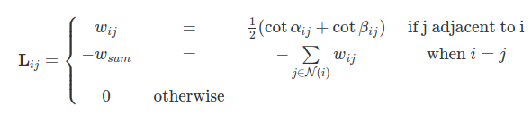

$$
\begin{align}
f(A,X;W) \rightarrow& \sigma((2I_N - \hat{M}) X W)
\end{align}
$$


# 実験: メッシュ復元

## 実験設定
頂点毎にメッシュの6次元特徴量を割り当て，平滑化メッシュから元のメッシュを復元するタスクを行わせる．
Pytorch Geometricで実装されているGCNConvと，新たに実装したMeshConvで性能の比較をする．

- 学習率: 0.001
- Epoch数: 1000
- 誤差評価指標: 頂点位置のMSE誤差

## 結果

- 正十二面体，凹凸球ともにMeshConvを用いたほうが低い誤差に収束した．
- 正十二面体では定性的な違いがわかりにくいが，凹凸球では復元性能に違いが見られる．

<table>
  <tr>
    <td width="24%">Input</td>
    <td width="24%">GCNConv</td>
    <td width="24%">MeshConv</td>
    <td width="24%">Ground truth</td>
  </tr>
  <tr>
    <td width="24%">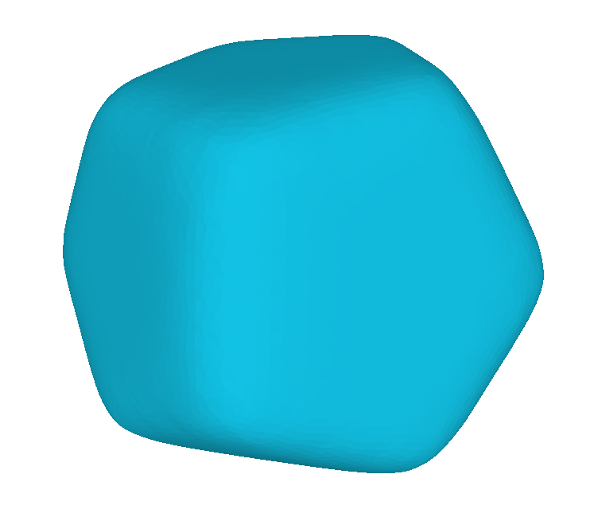</td>
    <td width="24%">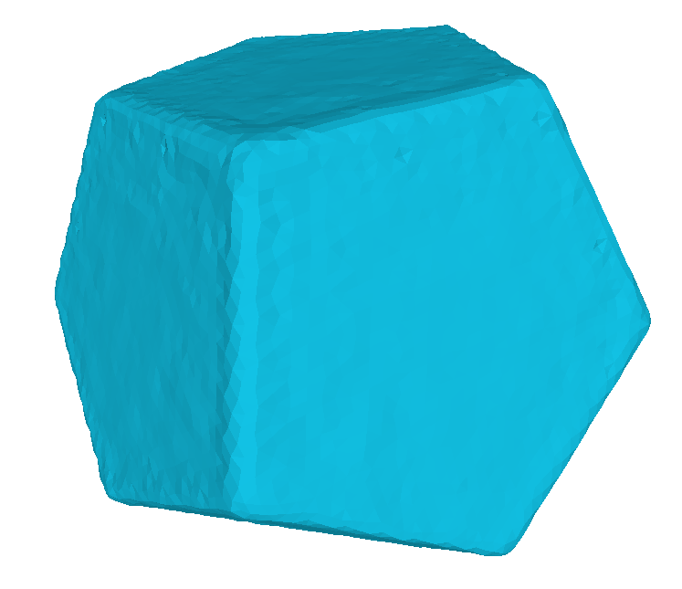</td>
    <td width="24%">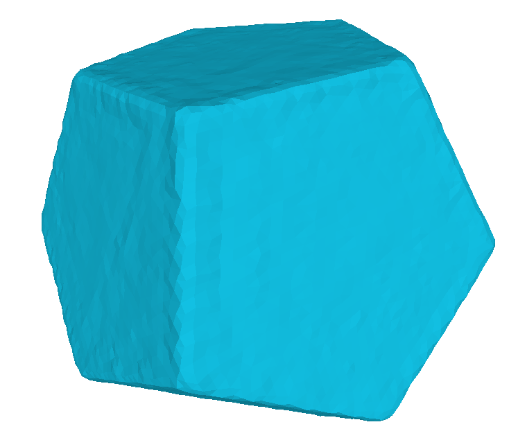</td>
    <td width="24%">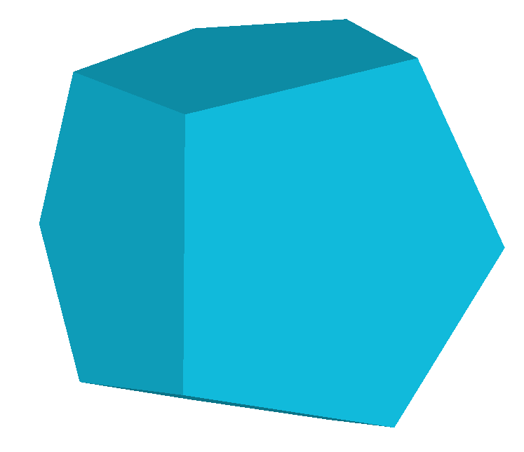</td>
  </tr>

  <tr>
    <td width="24%">---</td>
    <td width="24%">0.008221</td>
    <td width="24%">0.007452</td>
    <td width="24%">---</td>
  </tr>
  <tr>
    <td width="24%">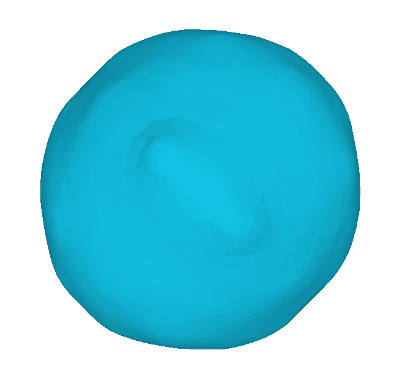</td>
    <td width="24%">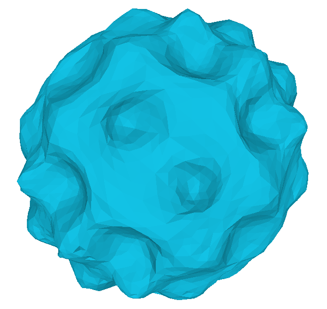</td>
    <td width="24%">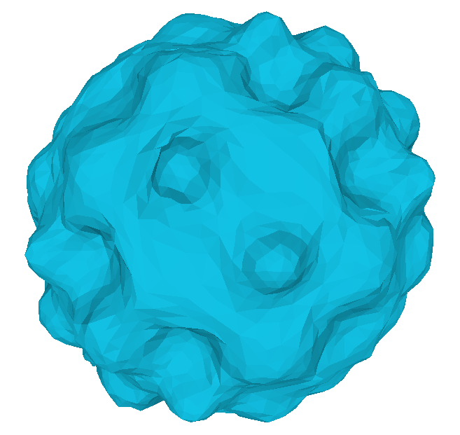</td>
    <td width="24%">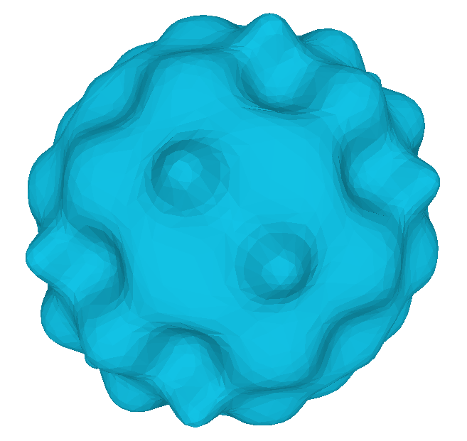</td>
  </tr>

  <tr>
    <td width="24%">---</td>
    <td width="24%">0.09511</td>
    <td width="24%">0.05705</td>
    <td width="24%">---</td>
  </tr>
</table>


## 誤差の推移

- いずれのメッシュでもMeshConvを用いた場合に誤差が低い値に収束した．

### 正十二面体
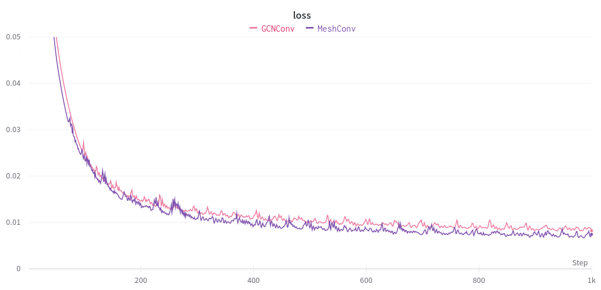

### 凹凸球
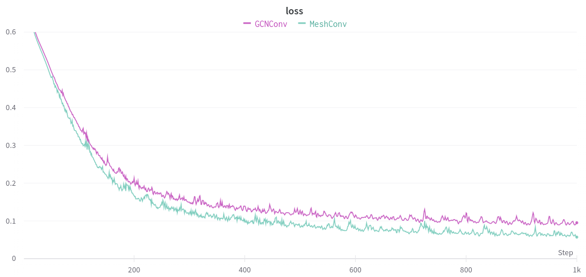